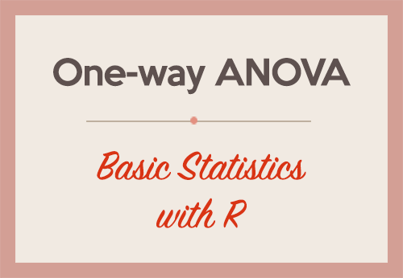

# One-way Analysis of Variance



This package assesses group differences using parametric 
one-way analysis of variance.

## more stuff

To download this package, use the following code:

```
if(!require(devtools)) {
  install.packages("devtools")
}
devtools::install_github("sross15//oneway", build_vignettes = TRUE)
```

The source code is available [here](https://github.com/sross15/oneway)
